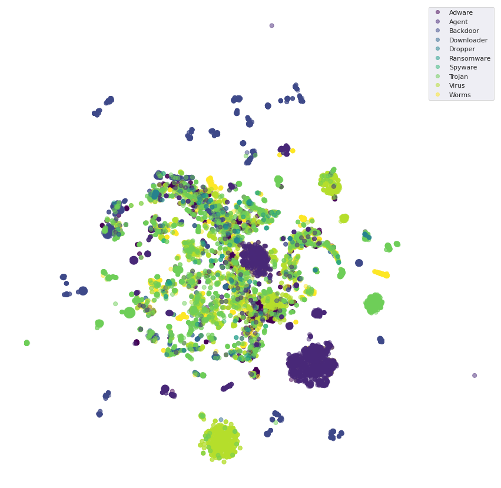
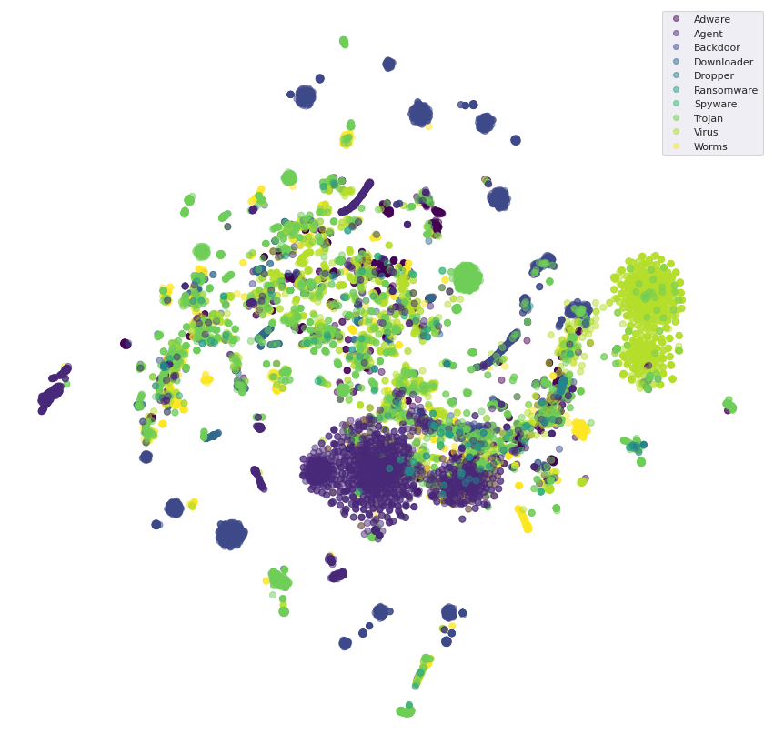
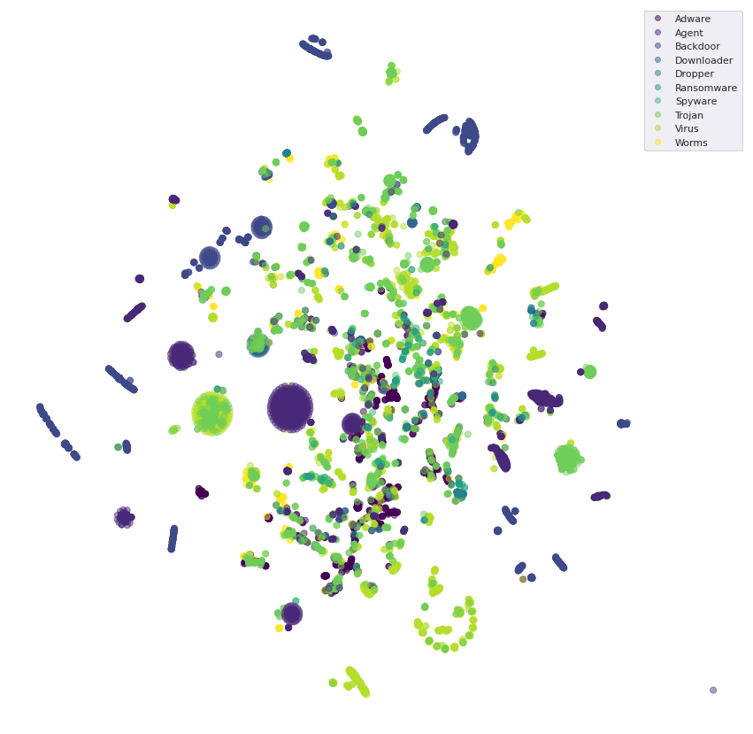
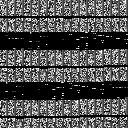

# Malware classification

In this topic, 04 classification models, which are RF, CNN, SVM and KNN, are used to classify the data set in order to find the best model and have a comparison between the classification models on a single method. When implemented, the results obtained from 03 classification models after training process, the overall average accuracy is obtained as follows: RF is 90.15%, KNN is 86.01%, CNN is 85% and SVM is 88.98%

# Data visualization (t-SNE)

- ALL
    
- entropy
    
- histogram
    
- section
    

# Other
- Image for CNN

    - Adware

    

     - Agent

    

     - Downloader
     
    

# Result 

	    Accuracy	Precision	Recall	    F1-score
    RF	90.15 % 	90.15 %	    90.15 %	    90.15 %
    KNN	86.01 %	    86.01 %	    86.01 %	    86.01 %
    SVM	88.98 %	    88.98 %	    88.98 %	    88.98 %
    CNN	85.56 %	    85.56 %	    85.56 %	    85.56 %
